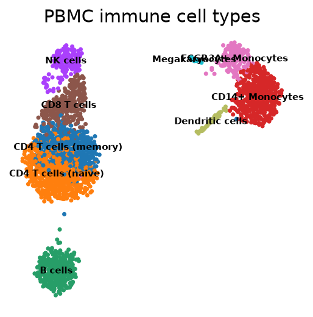
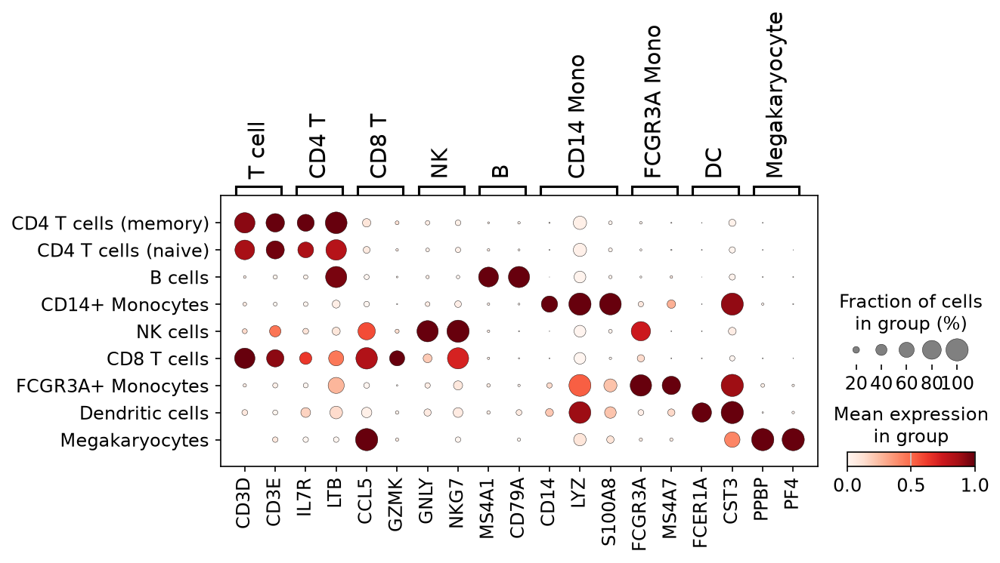

# Discovering Immune Cell Types in Human Blood with Single-Cell RNA-seq

A reproducible single-cell RNA-seq analysis of ~2,700 peripheral blood mononuclear
cells (PBMCs) from a healthy donor. Starting from raw gene counts, this project
identifies distinct immune cell populations using an unsupervised
quality-control → normalization → clustering → annotation workflow in
[Scanpy](https://scanpy.readthedocs.io/).

<!-- Put your headline figure here. Replace the path with your actual file. -->


---

## Background

Every cell carries the same DNA, but cell types differ in **which genes they
express**. Single-cell RNA-seq measures the gene expression of thousands of
individual cells at once, producing a cells × genes count matrix. The dataset
here is a mix of immune cells; the sequencer does **not** label what type each
cell is — recovering those identities from the data is the goal of this project.

**Question:** *Given ~2,700 anonymous immune cells and their gene expression, how
many distinct cell types are present, and which type is each cell?*

## Data

- **Source:** 10x Genomics PBMC 3k (healthy donor), a widely used single-cell benchmark.
- **Raw dimensions:** 2,700 cells × 32,738 genes (raw UMI counts).
- Download: `cf.10xgenomics.com/samples/cell-exp/1.1.0/pbmc3k/pbmc3k_filtered_gene_bc_matrices.tar.gz`

## Methods

| Step | What | Key parameters |
|---|---|---|
| Quality control | Removed empty droplets, dying cells, doublets | `min_genes=200`, `min_cells=3`, `pct_counts_mt < 5`, `n_genes_by_counts < 2500` |
| Normalization | Library-size normalization + log transform | `target_sum=1e4`, then `log1p` |
| Feature selection | Kept highly variable genes | `min_mean=0.0125`, `max_mean=3`, `min_disp=0.5` → **1838** genes |
| Dimensionality reduction | PCA → neighbor graph → UMAP | `n_pcs=40`, `n_neighbors=10` |
| Clustering | Leiden community detection | `resolution=1.0` → **9** clusters |
| Annotation | Marker genes (Wilcoxon) matched to canonical cell-type markers | see below |

<!-- Fill in the N values and the counts from YOUR run. -->

## Results

Nine immune cell populations were identified <!-- adjust to YOUR number -->:

| Cluster | Cell type | Key markers | # cells |
|---|---|---|---|
| 1 | CD4 T cells (naive) | IL7R, CD3D, ribosomal | 644 |
| 0 | CD4 T cells (memory) | IL7R, LTB, IL32, CD3D | 528 |
| 5 | CD8 T cells | CD3D, CCL5, GZMK, NKG7 | 277 |
| 4 | NK cells | GNLY, NKG7 (CD3-negative) | 163 |
| 2 | B cells | MS4A1, CD79A | 341 |
| 3 | CD14+ Monocytes | CD14, LYZ, S100A8 | 485 |
| 6 | FCGR3A+ Monocytes | FCGR3A, MS4A7, LST1 | 151 |
| 7 | Dendritic cells | FCER1A, CST3, HLA-DR | 36 |
| 8 | Megakaryocytes | PPBP, PF4 | 13 |

<!-- Fill cluster numbers and counts from YOUR run — they will differ from any tutorial. -->

**Marker gene validation:**



Each cell type expresses its canonical markers and little else (the diagonal),
confirming the annotation.

## Reproducibility notes

- Cluster **numbers** from Leiden are arbitrary and can change with software
  version or random seed. Cell-type assignments here were made from **marker
  genes**, not cluster order — so the biology is reproducible even if numbering
  differs on re-run.
- Exact environment is pinned in `environment.yml`.

## How to reproduce

```bash
# 1. Recreate the environment
conda env create -f environment.yml
conda activate pbmc

# 2. Launch Jupyter and run the notebook top to bottom
jupyter lab notebooks/01_pbmc_analysis.ipynb
```

## Repository structure

```
.
├── README.md
├── environment.yml
├── notebooks/01_pbmc_analysis.ipynb   # the full analysis
├── figures/                           # exported plots
└── results/                           # marker gene tables
```

## Tools

Python, Scanpy, AnnData, Leiden clustering, UMAP, NumPy, pandas, Matplotlib.

## Acknowledgements

Dataset: 10x Genomics. Workflow follows the standard Scanpy PBMC3k clustering
tutorial, re-implemented and documented as a learning project.

---

*Author: Ghashia Mukhtar · Quaid I Azam University,Islamabad · Jul-24-2026*
